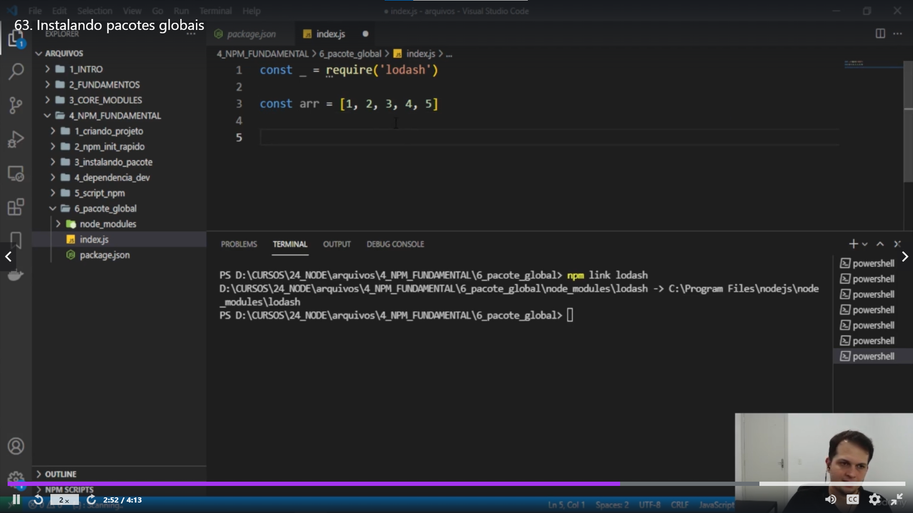

## Era mais fácil sim ter um markdown
pra rodar vai no packgejson e cria como quiser em scripts,
pra rodar os script sempre npm run + oq vc definiu na chave do script, exceto o start ele n precisa por o
run pra funcionar
 só o lodash tem que trazer dps de instalar um pacote
global, com flag -g
talvez tenha outros tbm mas sim da pra intalar pacotes de forma
global, pacotes externos no caso
lodash é um pacote para mexer com arrays etc comparar
alguns a gente pode instalar global e q vão igual no caso
do lodash precisar de um npm link

## npx
ele é um executador de pacotes enquanto npm instala tipo isso
por isso ele executa um script tipo isso e instala o react por ex.
